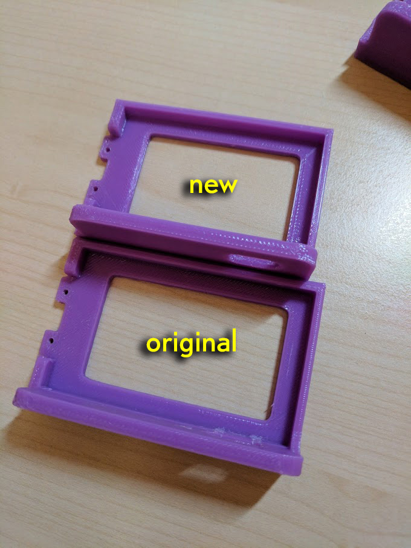
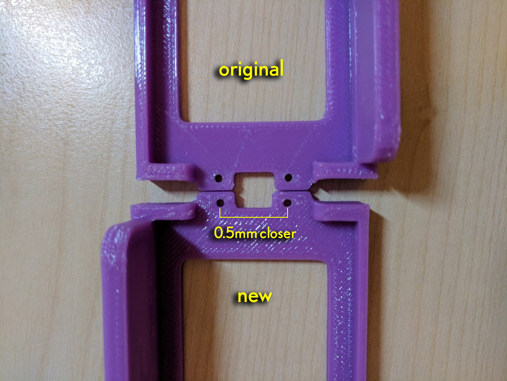
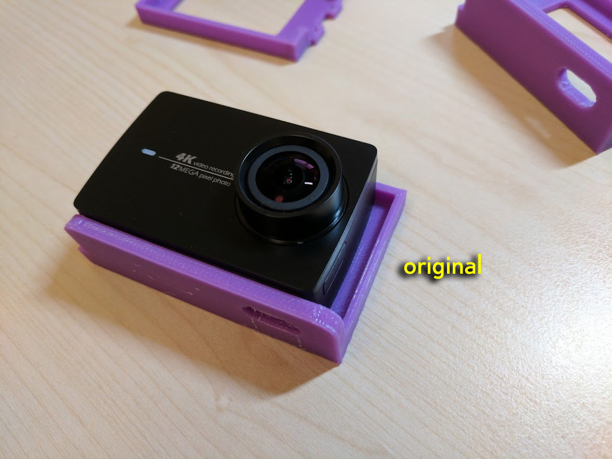
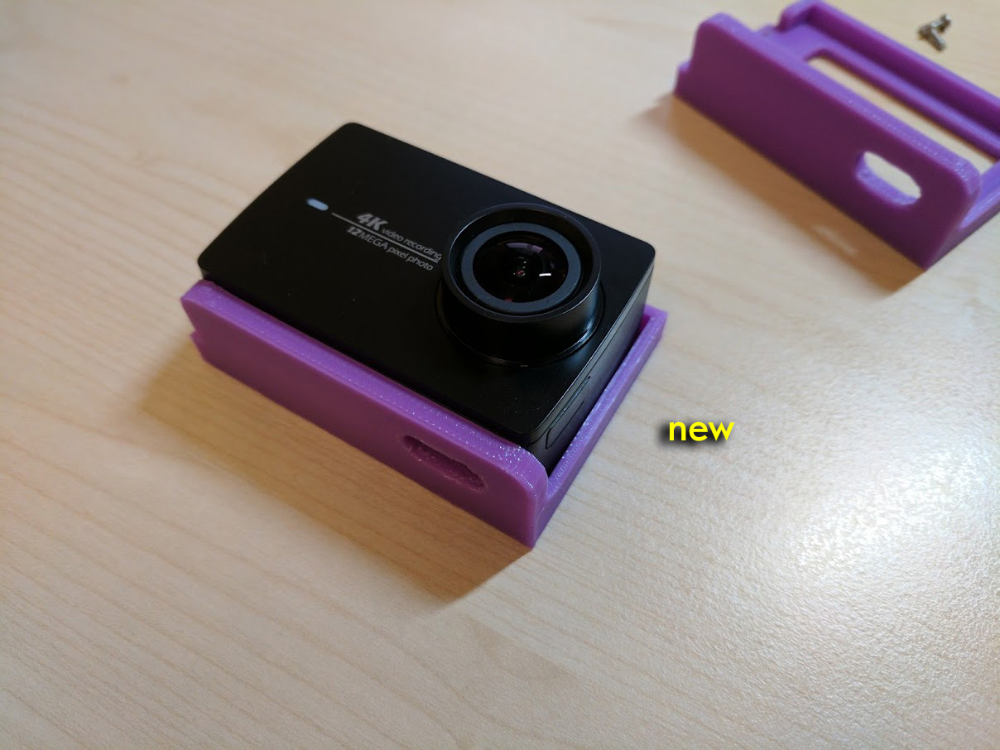
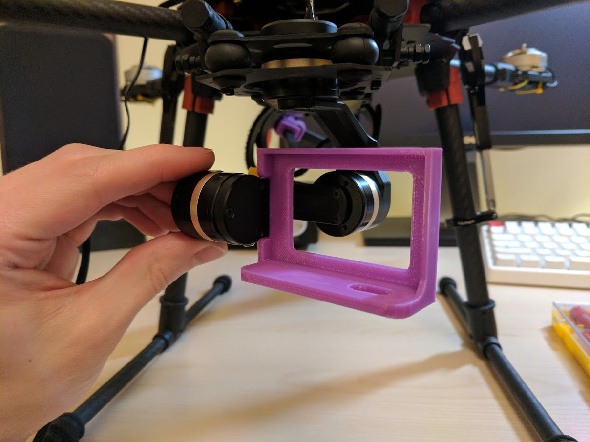

A 3D printable adapter to mount a Xiaomi Yi 4k camera to a Tarot TL3T01 gimbal (also known as the Tarot 3DⅢ).

Modified from the original version [shared on YouTube by Okan Akin](https://www.youtube.com/watch?v=DP3QlsVJCPA). The original was too wide for the camera & the holes through which to put the bolts to attach the adapter to the gimbal were slightly too far apart. I think the bolts I used were 6mm long M2.

A quick example of me testing the adapter [can be watched here](https://youtu.be/4R-7WbvqFD8?t=2m44s).

